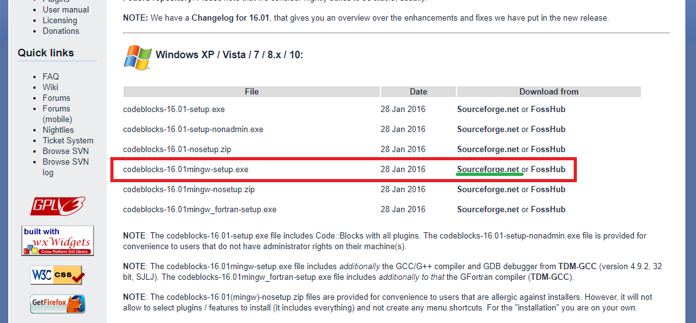
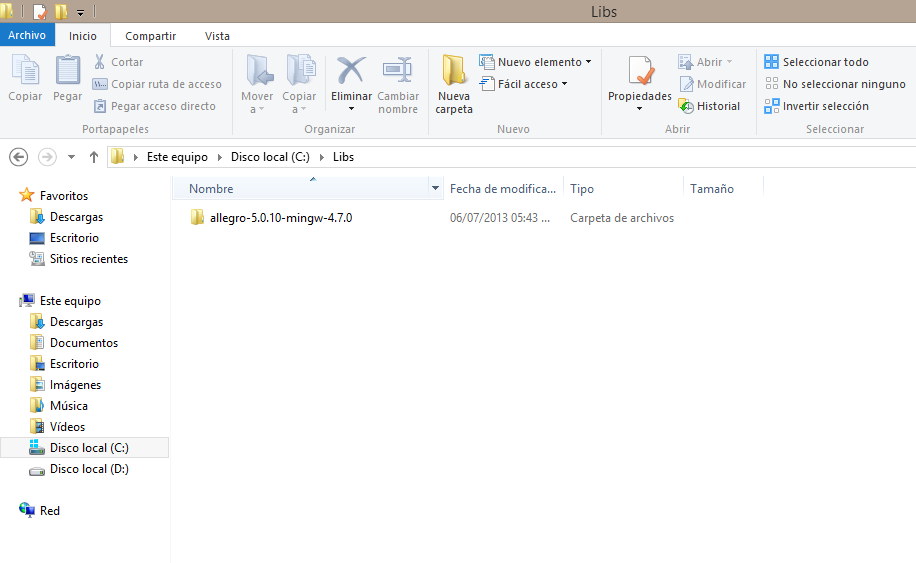

# Arkanoid Returns (Un Remake del juego Arkanoid)

Juego Arkanoid hecho en C++ con ayuda de la librería Allegro 5.

## Instalación (WINDOWS)

### 1 .- Codeblocks

Lo primero que debes hacer es descargar el instalador del IDE CodeBlocks, lo puedes hacer desde [ésta](http://www.codeblocks.org/downloads/26) página.



Luego de descargar el instalador lo ejecutas y sigues la típica instalación de un programa(next, next, next).

### 2 .- Allegro 5

Descarga los binarios de allegro 5 desde [Aquí](https://www.allegro.cc/files/)


### 3.- Extraer

Una vez descargado los binarios de allegro 5 vamos a extraer los archivolos archivos en una carpeta, yo lo extraigo en **C:\Libs\\**, pero **puedes extraerlo donde quieras**.



### 4.- Descargar el proyecto

Include files:
/usr/include/allegro5

Codeblocks build command:

```
g++ -L../../../../../usr/lib/x86_64-linux-gnu -Lsrc -o "bin/Debug/Arkanoid Returns" obj/Debug/main.o obj/Debug/src/About.o obj/Debug/src/Actor.o obj/Debug/src/ActorManager.o obj/Debug/src/AllegroException.o obj/Debug/src/Application.o obj/Debug/src/Ball.o obj/Debug/src/Block.o obj/Debug/src/Bonus.o obj/Debug/src/Border.o obj/Debug/src/BorderItem.o obj/Debug/src/Bullet.o obj/Debug/src/Button.o obj/Debug/src/Control.o obj/Debug/src/ControllableActor.o obj/Debug/src/ControllableObject.o obj/Debug/src/ControlManager.o obj/Debug/src/Exception.o obj/Debug/src/FileScores.o obj/Debug/src/Frame.o obj/Debug/src/Gallery.o obj/Debug/src/Game.o obj/Debug/src/GameOver.o obj/Debug/src/Help.o obj/Debug/src/HighScores.o obj/Debug/src/Interface.o obj/Debug/src/IntroductionLevel.o obj/Debug/src/Keyboard.o obj/Debug/src/Level.o obj/Debug/src/Menu.o obj/Debug/src/Mouse.o obj/Debug/src/Options.o obj/Debug/src/Pause.o obj/Debug/src/Peripheral.o obj/Debug/src/R.o obj/Debug/src/ResourceNotLoaded.o obj/Debug/src/Score.o obj/Debug/src/Sound.o obj/Debug/src/Sprite.o obj/Debug/src/StageManager.o obj/Debug/src/Utils.o obj/Debug/src/Vaus.o obj/Debug/src/Vector2.o   ../../../../../lib/x86_64-linux-gnu/liballegro.so ../../../../../lib/x86_64-linux-gnu/liballegro_acodec.so ../../../../../lib/x86_64-linux-gnu/liballegro_audio.so ../../../../../lib/x86_64-linux-gnu/liballegro_color.so ../../../../../lib/x86_64-linux-gnu/liballegro_dialog.so ../../../../../lib/x86_64-linux-gnu/liballegro_font.so ../../../../../lib/x86_64-linux-gnu/liballegro_image.so ../../../../../lib/x86_64-linux-gnu/liballegro_main.so ../../../../../lib/x86_64-linux-gnu/liballegro_memfile.so ../../../../../lib/x86_64-linux-gnu/liballegro_physfs.so ../../../../../lib/x86_64-linux-gnu/liballegro_primitives.so ../../../../../lib/x86_64-linux-gnu/liballegro_ttf.so ../../../../../lib/x86_64-linux-gnu/liballegro_video.so
```
